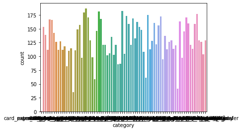
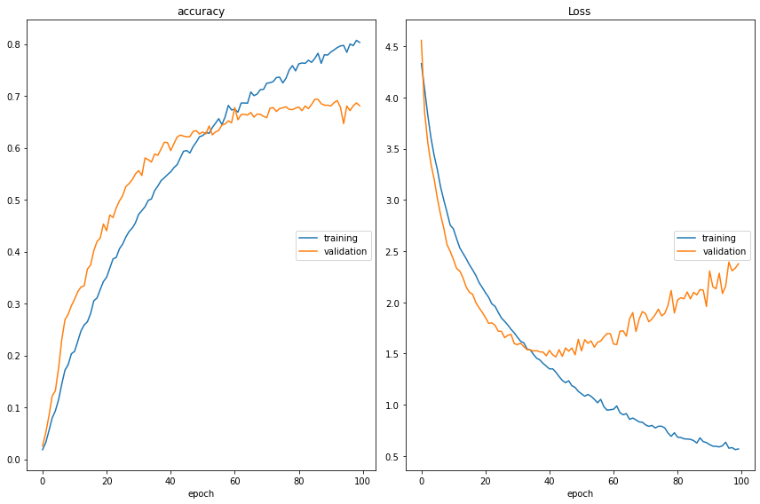
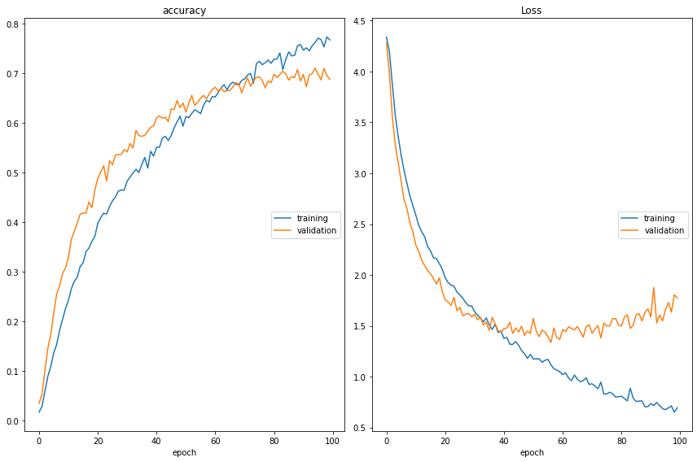

# Intent Classification using Deep Learning

## 1. Loading Data


```python
import numpy as np
import pandas as pd
from nltk.corpus import stopwords
from nltk.tokenize import word_tokenize
from nltk.stem.lancaster import LancasterStemmer
import nltk
import re
from sklearn.preprocessing import OneHotEncoder
import matplotlib.pyplot as plt
from keras.preprocessing.text import Tokenizer
from keras.preprocessing.sequence import pad_sequences
from keras.utils import to_categorical
from keras.models import Sequential, load_model
from keras.layers import Dense, GRU, LSTM, Bidirectional, Embedding, Dropout
from keras.callbacks import ModelCheckpoint
```

Dataset link: https://raw.githubusercontent.com/PolyAI-LDN/task-specific-datasets/master/banking_data/train.csv


```python
Intent = "category"
Sentence = "text"
```


```python
def load_dataset(filename, Sentence, Intent):
  df = pd.read_csv(filename, names = [Sentence, Intent])
  intent = df[Intent]
  unique_intent = list(set(intent))
  sentences = list(df[Sentence])
  
  return (df, intent, unique_intent, sentences)
```


```python
df, intent, unique_intent, sentences = load_dataset("Dataset.csv", "text", "category")
```


```python
print(df.head(10))
```

                                                    text      category
    0                                               text      category
    1                     I am still waiting on my card?  card_arrival
    2  What can I do if my card still hasn't arrived ...  card_arrival
    3  I have been waiting over a week. Is the card s...  card_arrival
    4  Can I track my card while it is in the process...  card_arrival
    5  How do I know if I will get my card, or if it ...  card_arrival
    6                  When did you send me my new card?  card_arrival
    7       Do you have info about the card on delivery?  card_arrival
    8  What do I do if I still have not received my n...  card_arrival
    9       Does the package with my card have tracking?  card_arrival


```python
import seaborn as sns
import tkinter
import matplotlib
matplotlib.use('agg')
import matplotlib.pyplot as plt
%matplotlib inline
sns.countplot(x=Intent, data=df)
```


    <AxesSubplot:xlabel='category', ylabel='count'>


    

    


```python
print(sentences[:5])
```

    ['text', 'I am still waiting on my card?', "What can I do if my card still hasn't arrived after 2 weeks?", 'I have been waiting over a week. Is the card still coming?', 'Can I track my card while it is in the process of delivery?']


```python
nltk.download("stopwords")
nltk.download("punkt")
```

    [nltk_data] Downloading package stopwords to
    [nltk_data]     /home/shiningflash/nltk_data...
    [nltk_data]   Package stopwords is already up-to-date!
    [nltk_data] Downloading package punkt to
    [nltk_data]     /home/shiningflash/nltk_data...
    [nltk_data]   Package punkt is already up-to-date!


    True


## 2. Data Cleaning


```python
#define stemmer
stemmer = LancasterStemmer()
```


```python
def cleaning(sentences):
  words = []
  for s in sentences:
    clean = re.sub(r'[^ a-z A-Z 0-9]', " ", s)
    w = word_tokenize(clean)
    words.append([i.lower() for i in w])
    
  return words 
```


```python
cleaned_words = cleaning(sentences)
print(len(cleaned_words))
print(cleaned_words[:2])  
```

    10004
    [['text'], ['i', 'am', 'still', 'waiting', 'on', 'my', 'card']]


## 3. Texts Tokenization


```python
def create_tokenizer(words, filters = '!"#$%&()*+,-./:;<=>?@[\]^_`{|}~'):
  token = Tokenizer(filters = filters)
  token.fit_on_texts(words)
  return token
```


```python
def max_length(words):
  return(len(max(words, key = len)))
```


```python
word_tokenizer = create_tokenizer(cleaned_words)
vocab_size = len(word_tokenizer.word_index) + 1
max_length = max_length(cleaned_words)

print("Vocab Size = %d and Maximum length = %d" % (vocab_size, max_length))
```

    Vocab Size = 2343 and Maximum length = 84


```python
def encoding_doc(token, words):
  return(token.texts_to_sequences(words))
```


```python
encoded_doc = encoding_doc(word_tokenizer, cleaned_words)
```


```python
def padding_doc(encoded_doc, max_length):
  return(pad_sequences(encoded_doc, maxlen = max_length, padding = "post"))
```


```python
padded_doc = padding_doc(encoded_doc, max_length)
```


```python
print("Shape of padded docs = ",padded_doc.shape)
```

    Shape of padded docs =  (10004, 84)


```python
#tokenizer with filter changed
output_tokenizer = create_tokenizer(unique_intent, filters = '!"#$%&()*+,-/:;<=>?@[\]^`{|}~')
```


```python
output_tokenizer.word_index
```


    {'verify_source_of_funds': 1,
     'topping_up_by_card': 2,
     'balance_not_updated_after_cheque_or_cash_deposit': 3,
     'visa_or_mastercard': 4,
     'request_refund': 5,
     'extra_charge_on_statement': 6,
     'wrong_amount_of_cash_received': 7,
     'atm_support': 8,
     'card_payment_fee_charged': 9,
     'pending_card_payment': 10,
     'transfer_fee_charged': 11,
     'getting_spare_card': 12,
     'wrong_exchange_rate_for_cash_withdrawal': 13,
     'top_up_by_cash_or_cheque': 14,
     'category': 15,
     'transfer_not_received_by_recipient': 16,
     'top_up_by_bank_transfer_charge': 17,
     'unable_to_verify_identity': 18,
     'refund_not_showing_up': 19,
     'pending_transfer': 20,
     'pin_blocked': 21,
     'top_up_by_card_charge': 22,
     'country_support': 23,
     'getting_virtual_card': 24,
     'pending_cash_withdrawal': 25,
     'card_payment_wrong_exchange_rate': 26,
     'declined_cash_withdrawal': 27,
     'fiat_currency_support': 28,
     'lost_or_stolen_phone': 29,
     'transfer_into_account': 30,
     'passcode_forgotten': 31,
     'terminate_account': 32,
     'verify_top_up': 33,
     'top_up_failed': 34,
     'declined_transfer': 35,
     'verify_my_identity': 36,
     'card_acceptance': 37,
     'direct_debit_payment_not_recognised': 38,
     'declined_card_payment': 39,
     'beneficiary_not_allowed': 40,
     'cash_withdrawal_charge': 41,
     'card_swallowed': 42,
     'automatic_top_up': 43,
     'supported_cards_and_currencies': 44,
     'compromised_card': 45,
     'card_arrival': 46,
     'virtual_card_not_working': 47,
     'change_pin': 48,
     'transfer_timing': 49,
     'reverted_card_payment': 50,
     'get_disposable_virtual_card': 51,
     'balance_not_updated_after_bank_transfer': 52,
     'exchange_charge': 53,
     'card_not_working': 54,
     'lost_or_stolen_card': 55,
     'card_payment_not_recognised': 56,
     'why_verify_identity': 57,
     'contactless_not_working': 58,
     'disposable_card_limits': 59,
     'activate_my_card': 60,
     'card_about_to_expire': 61,
     'apple_pay_or_google_pay': 62,
     'card_delivery_estimate': 63,
     'exchange_rate': 64,
     'edit_personal_details': 65,
     'card_linking': 66,
     'get_physical_card': 67,
     'cash_withdrawal_not_recognised': 68,
     'order_physical_card': 69,
     'transaction_charged_twice': 70,
     'cancel_transfer': 71,
     'top_up_reverted': 72,
     'age_limit': 73,
     'failed_transfer': 74,
     'receiving_money': 75,
     'top_up_limits': 76,
     'exchange_via_app': 77,
     'pending_top_up': 78}


```python
encoded_output = encoding_doc(output_tokenizer, intent)
```


```python
encoded_output = np.array(encoded_output).reshape(len(encoded_output), 1)
```


```python
encoded_output.shape
```


    (10004, 1)


```python
def one_hot(encode):
  o = OneHotEncoder(sparse = False)
  return(o.fit_transform(encode))
```


```python
output_one_hot = one_hot(encoded_output)
```


```python
output_one_hot.shape
```


    (10004, 78)


```python
from sklearn.model_selection import train_test_split
```


```python
train_X, val_X, train_Y, val_Y = train_test_split(padded_doc, output_one_hot, shuffle = True, test_size = 0.2)
```


```python
print("Shape of train_X = %s and train_Y = %s" % (train_X.shape, train_Y.shape))
print("Shape of val_X = %s and val_Y = %s" % (val_X.shape, val_Y.shape))
```

    Shape of train_X = (8003, 84) and train_Y = (8003, 78)
    Shape of val_X = (2001, 84) and val_Y = (2001, 78)


## 4. Bidirectional GRU 


```python
from livelossplot.tf_keras import PlotLossesCallback
from livelossplot import PlotLossesKeras
```


```python
def create_model(vocab_size, max_length):
  model = Sequential()
  model.add(Embedding(vocab_size, 128, input_length = max_length, trainable = False))
  model.add(Bidirectional(GRU(128)))
  model.add(Dense(32, activation = "relu"))
  model.add(Dropout(0.5))
  model.add(Dense(78, activation = "softmax"))
  
  return model
```


```python
model = create_model(vocab_size, max_length)

model.compile(loss = "categorical_crossentropy", optimizer = "adam", metrics = ["accuracy"])
model.summary()
```

    Model: "sequential"
    _________________________________________________________________
    Layer (type)                 Output Shape              Param #   
    =================================================================
    embedding (Embedding)        (None, 84, 128)           299904    
    _________________________________________________________________
    bidirectional (Bidirectional (None, 256)               198144    
    _________________________________________________________________
    dense (Dense)                (None, 32)                8224      
    _________________________________________________________________
    dropout (Dropout)            (None, 32)                0         
    _________________________________________________________________
    dense_1 (Dense)              (None, 78)                2574      
    =================================================================
    Total params: 508,846
    Trainable params: 208,942
    Non-trainable params: 299,904
    _________________________________________________________________


```python
filename = 'model.h5'
checkpoint = ModelCheckpoint(filename,
                             monitor='val_loss',
                             verbose=1,
                             save_best_only=True,
                             mode='min')
```


```python
hist = model.fit(train_X, train_Y,
                 epochs = 100,
                 batch_size = 32,
                 validation_data = (val_X, val_Y),
                 callbacks = [PlotLossesKeras(), checkpoint])
```


    

    


    accuracy
    	training         	 (min:    0.018, max:    0.807, cur:    0.803)
    	validation       	 (min:    0.025, max:    0.694, cur:    0.681)
    Loss
    	training         	 (min:    0.562, max:    4.331, cur:    0.568)
    	validation       	 (min:    1.468, max:    4.558, cur:    2.376)
    
    Epoch 00100: val_loss did not improve from 1.46752
    251/251 [==============================] - 27s 107ms/step - loss: 0.5683 - accuracy: 0.8031 - val_loss: 2.3763 - val_accuracy: 0.6812


## 5. Bidirectional LSTM 


```python
def create_model(vocab_size, max_length):
  model = Sequential()
  model.add(Embedding(vocab_size, 128, input_length = max_length, trainable = False))
  model.add(Bidirectional(LSTM(128)))
  model.add(Dense(32, activation = "relu"))
  model.add(Dropout(0.5))
  model.add(Dense(78, activation = "softmax"))
  
  return model

model_lstm = create_model(vocab_size, max_length)

model_lstm.compile(loss = "categorical_crossentropy", optimizer = "adam", metrics = ["accuracy"])
model_lstm.summary()
```

    Model: "sequential_1"
    _________________________________________________________________
    Layer (type)                 Output Shape              Param #   
    =================================================================
    embedding_1 (Embedding)      (None, 84, 128)           299904    
    _________________________________________________________________
    bidirectional_1 (Bidirection (None, 256)               263168    
    _________________________________________________________________
    dense_2 (Dense)              (None, 32)                8224      
    _________________________________________________________________
    dropout_1 (Dropout)          (None, 32)                0         
    _________________________________________________________________
    dense_3 (Dense)              (None, 78)                2574      
    =================================================================
    Total params: 573,870
    Trainable params: 273,966
    Non-trainable params: 299,904
    _________________________________________________________________


```python
filename = 'model.h5'
checkpoint = ModelCheckpoint(filename,
                             monitor='val_loss',
                             verbose=1,
                             save_best_only=True,
                             mode='min')

hist = model_lstm.fit(train_X, train_Y,
                 epochs = 100,
                 batch_size = 32,
                 validation_data = (val_X, val_Y),
                 callbacks = [PlotLossesKeras(), checkpoint])
```


    

    


    accuracy
    	training         	 (min:    0.017, max:    0.774, cur:    0.768)
    	validation       	 (min:    0.034, max:    0.711, cur:    0.688)
    Loss
    	training         	 (min:    0.651, max:    4.339, cur:    0.695)
    	validation       	 (min:    1.337, max:    4.285, cur:    1.775)
    
    Epoch 00100: val_loss did not improve from 1.33676
    251/251 [==============================] - 27s 108ms/step - loss: 0.6949 - accuracy: 0.7677 - val_loss: 1.7749 - val_accuracy: 0.6882


```python
model_lstm = load_model("model.h5")
```


```python
def predictions(text):
  clean = re.sub(r'[^ a-z A-Z 0-9]', " ", text)
  test_word = word_tokenize(clean)
  test_word = [w.lower() for w in test_word]
  test_ls = word_tokenizer.texts_to_sequences(test_word)
  
  #Check for unknown words
  if [] in test_ls:
    test_ls = list(filter(None, test_ls))
    
  test_ls = np.array(test_ls).reshape(1, len(test_ls))
  x = padding_doc(test_ls, max_length)

  pred = model_lstm.predict(x)
  return pred
```


```python
def get_final_output(pred, classes):
  predictions = pred[0]
  classes = np.array(classes)
  ids = np.argsort(-predictions)
  classes = classes[ids]
  predictions = -np.sort(-predictions)
 
  for i in range(pred.shape[1]):
    print("%s has confidence = %s" % (classes[i], (predictions[i])))
  
  return classes[0]
```


```python
text = "I am still waiting on my card?"
pred = predictions(text)
result = get_final_output(pred, unique_intent)
print('\nans: {}\n'.format(result))
```

    card_arrival has confidence = 0.5400851
    lost_or_stolen_card has confidence = 0.13254714
    card_not_working has confidence = 0.099424854
    contactless_not_working has confidence = 0.05694259
    compromised_card has confidence = 0.02806151
    card_about_to_expire has confidence = 0.024988813
    card_delivery_estimate has confidence = 0.024908025
    declined_card_payment has confidence = 0.023217054
    card_linking has confidence = 0.019666543
    activate_my_card has confidence = 0.019631721
    card_swallowed has confidence = 0.015140002
    reverted_card_payment? has confidence = 0.011102826
    atm_support has confidence = 0.0015607645
    declined_cash_withdrawal has confidence = 0.0007894527
    lost_or_stolen_phone has confidence = 0.00065130007
    card_payment_not_recognised has confidence = 0.00042219783
    cash_withdrawal_not_recognised has confidence = 0.0002289453
    card_acceptance has confidence = 0.0001782307
    declined_transfer has confidence = 0.00015152607
    pin_blocked has confidence = 9.299157e-05
    passcode_forgotten has confidence = 5.496411e-05
    order_physical_card has confidence = 3.1216285e-05
    unable_to_verify_identity has confidence = 2.856871e-05
    transaction_charged_twice has confidence = 1.5831929e-05
    beneficiary_not_allowed has confidence = 1.5821604e-05
    country_support has confidence = 1.3478491e-05
    pending_card_payment has confidence = 1.0269475e-05
    why_verify_identity has confidence = 9.724789e-06
    receiving_money has confidence = 6.8202044e-06
    direct_debit_payment_not_recognised has confidence = 5.4109573e-06
    virtual_card_not_working has confidence = 2.912666e-06
    supported_cards_and_currencies has confidence = 2.4180426e-06
    pending_cash_withdrawal has confidence = 2.1170988e-06
    topping_up_by_card has confidence = 2.0330606e-06
    request_refund has confidence = 1.1766249e-06
    transfer_not_received_by_recipient has confidence = 1.0827664e-06
    card_payment_fee_charged has confidence = 1.0126768e-06
    visa_or_mastercard has confidence = 6.679286e-07
    terminate_account has confidence = 5.908272e-07
    Refund_not_showing_up has confidence = 3.619633e-07
    top_up_failed has confidence = 3.1810998e-07
    cancel_transfer has confidence = 2.8714103e-07
    verify_top_up has confidence = 2.622885e-07
    category has confidence = 2.5423205e-07
    getting_spare_card has confidence = 1.889249e-07
    transfer_fee_charged has confidence = 1.5563825e-07
    age_limit has confidence = 1.2111296e-07
    pending_top_up has confidence = 6.930501e-08
    get_physical_card has confidence = 5.6756654e-08
    getting_virtual_card has confidence = 5.3940063e-08
    top_up_by_cash_or_cheque has confidence = 4.5198856e-08
    failed_transfer has confidence = 1.5451935e-08
    edit_personal_details has confidence = 1.4790701e-08
    exchange_rate has confidence = 1.3748348e-08
    wrong_amount_of_cash_received has confidence = 1.2084236e-08
    top_up_reverted has confidence = 1.031402e-08
    change_pin has confidence = 7.595862e-09
    verify_my_identity has confidence = 5.57865e-09
    balance_not_updated_after_bank_transfer has confidence = 2.6290028e-09
    verify_source_of_funds has confidence = 2.390937e-09
    automatic_top_up has confidence = 1.8031706e-09
    card_payment_wrong_exchange_rate has confidence = 1.7656182e-09
    top_up_by_card_charge has confidence = 1.2948175e-09
    wrong_exchange_rate_for_cash_withdrawal has confidence = 9.181001e-10
    fiat_currency_support has confidence = 8.16949e-10
    balance_not_updated_after_cheque_or_cash_deposit has confidence = 6.584936e-10
    transfer_timing has confidence = 4.593117e-10
    apple_pay_or_google_pay has confidence = 2.880023e-10
    top_up_by_bank_transfer_charge has confidence = 2.7394342e-10
    cash_withdrawal_charge has confidence = 1.2649745e-10
    exchange_charge has confidence = 9.780896e-11
    extra_charge_on_statement has confidence = 8.268214e-11
    transfer_into_account has confidence = 5.788913e-11
    get_disposable_virtual_card has confidence = 4.7355724e-11
    pending_transfer has confidence = 1.560852e-11
    exchange_via_app has confidence = 5.856411e-12
    disposable_card_limits has confidence = 1.6419753e-12
    top_up_limits has confidence = 7.180127e-14
    
    ans: card_arrival
    


```python
def get_only_final_output(pred, classes):
  predictions = pred[0]
  classes = np.array(classes)
  ids = np.argsort(-predictions)
  classes = classes[ids]
  predictions = -np.sort(-predictions)
  
  return classes[0]
```


```python
def get_intent(text):
  pred = predictions(text)
  result = get_only_final_output(pred, unique_intent)
  print('ans: {}'.format(result))
```


```python
get_intent("I am still waiting on my card?")
```

    ans: card_arrival


```python
get_intent("What are you exchange rates?")
```

    ans: exchange_rate


```python
get_intent("Which countries are represented?")
```

    ans: country_support

